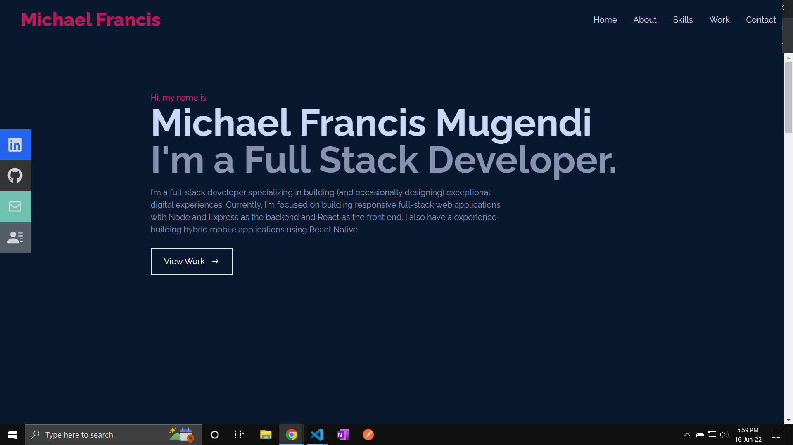
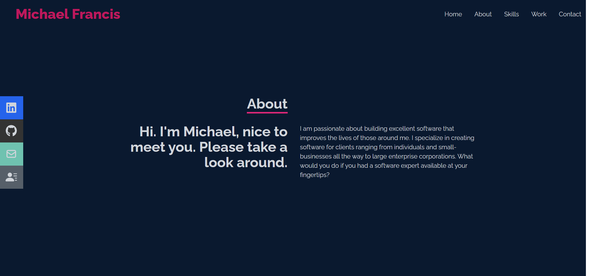
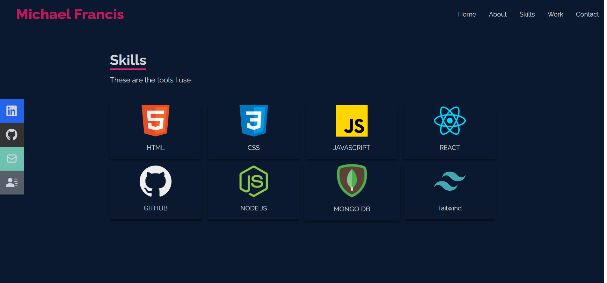
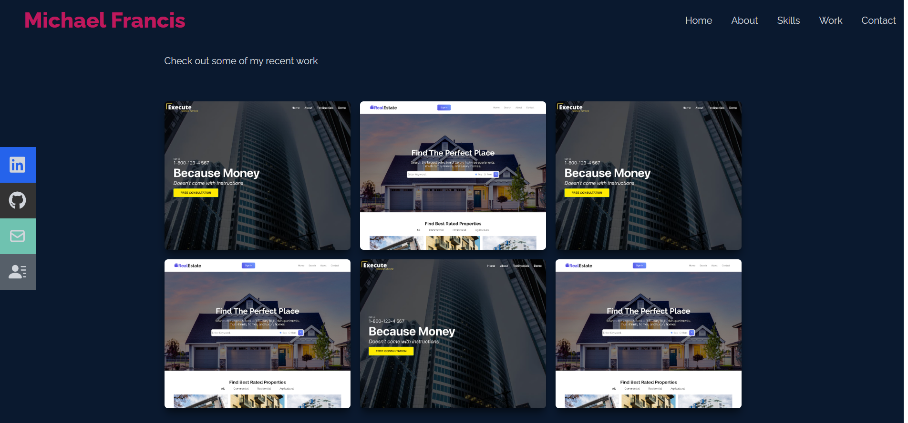
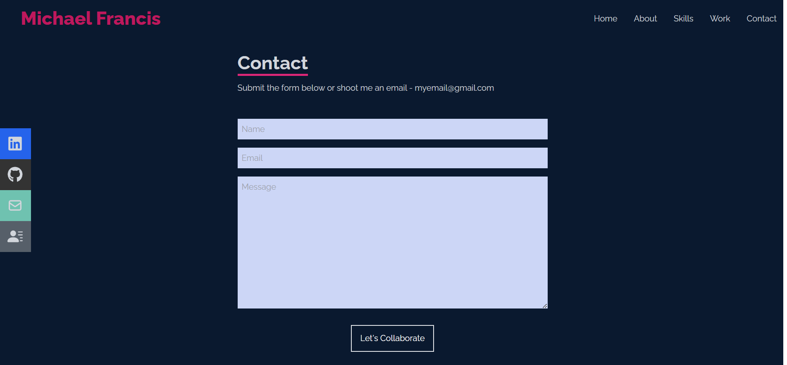

# Simple portfolio project

The single page application was made with React 18 and Tailwind, it's made of a few components including Nav, Home, About, Skills and a Contact form with the help of Git submit form project.

Link to the project demo [Portfolio](https://myk-francis.github.io/michael-portfolio/).

### Screens

